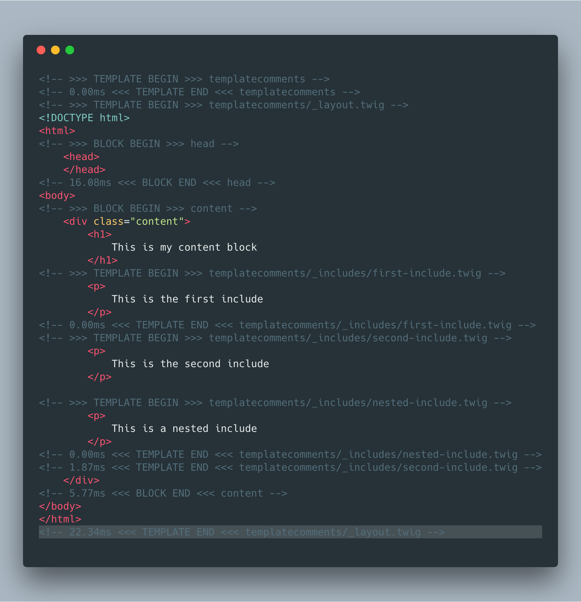

# Template Comments plugin for Craft CMS 3.x

Adds a HTML comment to demarcate ``s and each Twig template that is included or extended.


## Requirements

This plugin requires Craft CMS 3.0.0 or later.

## Installation

To install the plugin, follow these instructions.

1. Open your terminal and go to your Craft project:

        cd /path/to/project

2. Then tell Composer to load the plugin:

        composer require nystudio107/craft-templatecomments

3. In the Control Panel, go to Settings → Plugins and click the “Install” button for Template Comments.

You can also install Template Comments via the **Plugin Store** in the Craft AdminCP.

## Template Comments Overview

Template Comments is a debugging tool that wraps your Twig ``s and templates that you `` with HTML comments. By default, it does this only when `devMode` is on.

With more complicated "content builder" setups, this can help bring clarity to where the various HTML on your pages is coming from.

This can be especially handy when dealing with OPC (Other People's Code).



## Configuring Template Comments

All configuration is done via the `config.php`. For it to work, you'll need to copy it to your `craft/config/` directory, and rename it `templatecomments.php`

Here's what the default settings look like:

```php
return [
    /**
     * @var bool Whether comments should be generated for site templates
     */
    'siteTemplateComments' => true,

    /**
     * @var bool Whether comments should be generated for AdminCP templates
     */
    'cpTemplateComments' => false,

    /**
     * @var bool Whether to generate comments only when `devMode` is on
     */
    'onlyCommentsInDevMode' => false,

    /**
     * @var bool Whether or not to show comments for templates that are include'd
     */
    'templateCommentsEnabled' => true,

    /**
     * @var bool Whether or not to show comments for ``s
     */
    'blockCommentsEnabled' => true,
];
```

## Using Template Comments

Nothing much to say here; install the plugin, and it "just works". If `devMode` is off, it doesn't even install itself, so there should be zero effect in production.

## Template Comments Roadmap

Some things to do, and ideas for potential features:

* Support wrapping macros in comments

Brought to you by [nystudio107](https://nystudio107.com/)
